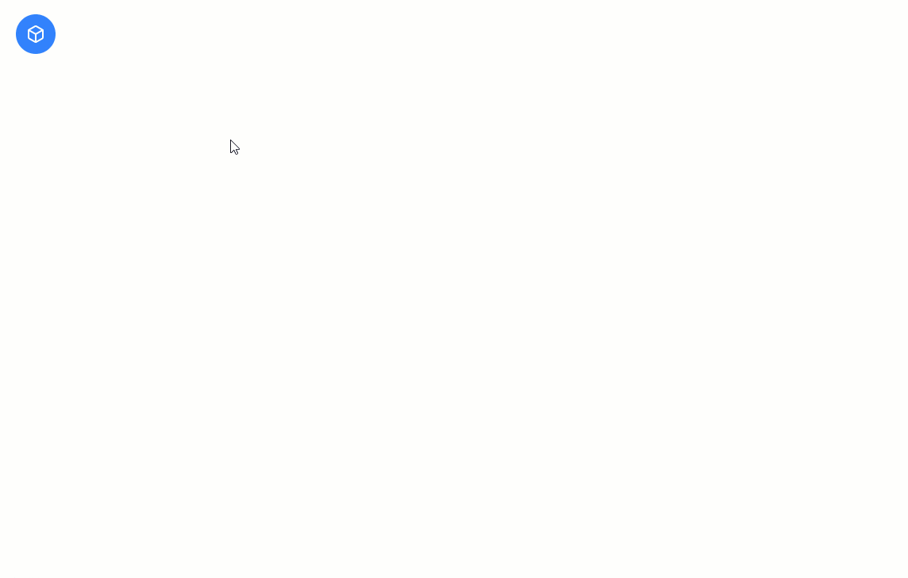
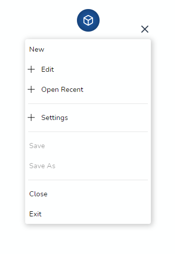
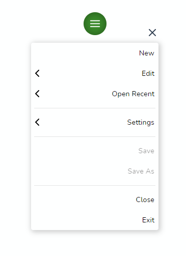
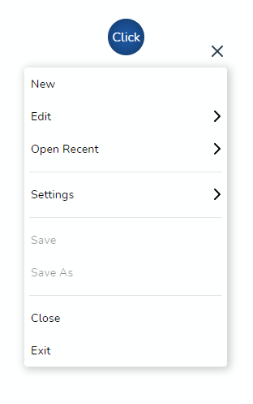

<div align="center">
  
</div>

<br/>

[](https://dev.azure.com/prabhummurthy/float-menu/_build/latest?definitionId=9&branchName=master)
[](https://codeclimate.com/github/prabhuignoto/float-menu/maintainability)
[](https://deepscan.io/dashboard#view=project&tid=10074&pid=13372&bid=223016)
[](https://deepsource.io/gh/prabhuignoto/vue-float-menu/?ref=repository-badge)


[](https://depfu.com/github/prabhuignoto/float-menu?project_id=15010)

<div align="center">
  
</div>

<h2>✨ Features</h2>

- 👌 &nbsp;[Drag](#-demo) and place the menu anywhere on screen.
- 👓 The smart menu system detects the edges of the screen and flips the menu automatically.
- 👍 Support for nested menus.
- ⌨ Keyboard Accessible.
- 🌈 Support for custom [themes](#-theme).
- 💪 Built with [Typescript](https://www.typescriptlang.org/).
- 🧰 Intuitive [API](#props) with data driven behavior.
- 🌠 Built with the all new [Vue 3](https://v3.vuejs.org/).

<h2>Table of Contents</h2>

- [⚡ Installation](#-installation)
- [🚀 Getting Started](#-getting-started)
- [Props](#props)
  - [Position](#position)
  - [Menu head dimension](#menu-head-dimension)
  - [Menu dimension](#menu-dimension)
  - [Menu Style](#menu-style)
  - [Populating the Menu](#populating-the-menu)
  - [on-select](#on-select)
  - [Flip on edges](#flip-on-edges)
  - [Fixed Menu](#fixed-menu)
  - [🎨 Custom icon](#-custom-icon)
  - [🎭 Icon support](#-icon-support)
  - [🌈 Theme](#-theme)
- [📦 Build Setup](#-build-setup)
- [🔨 Contributing](#-contributing)
- [🧱 Built with](#-built-with)
- [Notes](#notes)
- [Meta](#meta)

  - [Menu head dimension](#menu-head-dimension)
  - [Menu dimension](#menu-dimension)
  - [Menu Style](#menu-style)
  - [Populating the Menu](#populating-the-menu)
  - [on-select](#on-select)
  - [Flip on edges](#flip-on-edges)
  - [Fixed Menu](#fixed-menu)
  - [🎨 Custom icon](#-custom-icon)
  - [🌈 Theme](#-theme)
- [📦 Build Setup](#-build-setup)
- [🔨 Contributing](#-contributing)
- [Built with](#built-with)
- [Notes](#notes)
- [Meta](#meta)

## ⚡ Installation

```sh
pnpm install vue-float-menu
```

## 🚀 Getting Started

vue-float-menu has some great defaults. Please check the [props](#props) section for all available options.

`vue-float-menu` finds the optimal menu orientation depending on the position of the menu. for e.g if the menu is placed at the bottom edge and the orientation set to `bottom`, the component will automatically flip the orientation to `top`.

Here is a basic example that sets the default position of the menu as `top left`.

```sh
<template>
  <float-menu
    :position="'top left'"
    :dimension="50"
    :menu-data="items"
    :on-selected="handleSelection"
  >
    Drag
  </float-menu>
</template>

<script>
import { FloatMenu } from "vue-float-menu";
import "vue-float-menu/dist/vue-float-menu.css";

export default {
  components: {
    FloatMenu,
  },
  setup() {
    const handleSelection = (selectedItem) => {
      console.log(selectedItem);
    };
    return {
      handleSelection,
    };
  },
  data() {
    return {
      items: [
        { name: "New" },
        {
          name: "Edit",
          subMenu: {
            name: "edit-items",
            items: [{ name: "Copy" }, { name: "Paste" }],
          },
        },
        {
          name: "Open Recent"
        },
        {
          name: "Save",
        }
      ],
    };
  },
};
</script>
```

## Props

| Prop             | Type     | Description                                                                                                                      |
| ---------------- | -------- | -------------------------------------------------------------------------------------------------------------------------------- |
| dimension        | number   | dimension of the Menu Head `width x height` in pixels.                                                                           |
| position         | String   | initial position of the Menu Head. can be any one of the values `top left`, `top right`, `bottom left`, `bottom right`           |
| fixed            | Boolean  | disables dragging and the menu will be fixed. use the `position` prop to fix the menu position                                   |
| menu-dimension   | Object   | sets the `width` and `minimum` height of the Menu.                                                                               |
| menu-data        | Object   | data to generate the menu. refer to [populating the menu](#populating-the-menu) for usage details.                               |
| on-selected      | Function | hook that is called on selection.                                                                                                |
| menu-style       | String   | can be `slide-out` or `accordion`.`slide-out` is the default menu style.                                                         |
| flip-on-edges    | Boolean  | flips the menu content on the right edges of the screen.                                                                         |
| theme            | Object   | prop to customize the color schemes. refer [theme](#theme) for usage.                                                            |

### Position

The `position` prop can be used to set the initial position of the Menu Head. The prop can accept any one of the following values.

- `top left` (default)
- `top right`
- `bottom left`
- `bottom right`

```sh
  <float-menu :dimension=50 position="bottom right">
    <template #icon>
      <BoxIcon />
    </template>
  </float-menu>
```

### Menu head dimension

`dimension` prop can be used to set the width and height of the menu head. The prop takes a single number value to set the height and width of the Menu Head.

```sh
  <float-menu :dimension=50>
    <template #icon>
      <BoxIcon />
    </template>
  </float-menu>
```

### Menu dimension

prop to set the `height` and `width` of the menu.

```sh
  <float-menu
    :dimension=50
    :menu-dimension="{height: 400, width: 300}"
    position="bottom right"
  >
    <template #icon>
      <BoxIcon />
    </template>
  </float-menu>
```

### Menu Style

The component supports two modes `slide-out`(default) and `accordion`. The `accordion` style is more suitable for mobile devices.

```sh
  <float-menu
    position="bottom right"
    flip-on-edges
    menu-style="accordion"
  >
    <template #icon>
      <BoxIcon />
    </template>
  </float-menu>
```



### Populating the Menu

Use the `menu-data` prop to create simple or nested menus of your liking. `menu-data` takes an array of `MenuItem` type

`MenuItem` properties

| property    | description                                                           |
| ----------- | --------------------------------------------------------------------- |
| name        | display name of the menu item.                                        |
| subMenu     | data for the sub-menu                                                 |
| disabled    | disables the menu item                                                |
| divider     | makes the item as a divider                                           |

Here we create a simple Menu structure with 3 Menu items with no sub menus.

```sh
const menuData = [
  { name: "New" },
  {
    name: "Edit",
    subMenu: {
      name: "edit-items",
      items: [{ name: "Copy" }, { name: "Paste", disabled: true }],
    },
  },
  {divider: true},
  {
    name: "Open Recent",
    subMenu: {
      name: "recent-items",
      items: [{ name: "Document 1" }, {divider: true}, { name: "Document 2" }],
    },
  },
]
```

```sh
  <float-menu
    :dimension=50
    :menu-dimension="{height: 400, width: 300}"
    :menu-data="menuData"
    position="bottom right"
  >
    <BoxIcon />
  </float-menu>
```

### on-select

hook for the menu item selection event.

```sh
  <float-menu
    :dimension=50
    position="bottom right"
    :menu-dimension="{height: 400, width: 300}"
    :menu-data="{items: [{name: 'File'}, {name: 'Open'}]}"
    on-select="handleSelection"
  >
    <BoxIcon />
  </float-menu>
```

### Flip on edges

setting this prop `flips` the menu content on the right edges of the screen.

```sh
  <float-menu
    :dimension=50
    position="bottom right"
    flip-on-edges
    on-select="handleSelection"
  >
    <BoxIcon />
  </float-menu>
```



### Fixed Menu

To disable dragging and to fix the position statically, set `fixed` to `true`. This prop is disabled by default. Use this prop along with the `position` prop to set the desired position.

```sh
  <float-menu :dimension=50 position="bottom right" fixed>
    <template #icon>
      <BoxIcon />
    </template>
  </float-menu>
```

### 🎨 Custom icon

To customize the Menu Icon, simply pass any content in between the `float-menu` tags. Here we render a custom icon.

```sh
  <float-menu
    :dimension=50
    :menu-data="menuData"
  >
    <template #icon>
      <BoxIcon />
    </template>
  </float-menu>
```

and here we render a text `Click` inside the Menu handle

```sh
  <float-menu
    :dimension=50
    :menu-data="menuData"
  >
    Click
  </float-menu>
```



### 🎭 Icon support

Each menu item can be iconified and the component uses slots to inject the icons.

Pass individual icons (or images) as templates marked with a unique `slot id`. please make sure the `ids` match the `iconSlot` property in the items array.

```sh
<float-menu
  :menu-data="items"
>
  <template #new>
    
  </template>
  <template #edit>
    
  </template>
</float-menu>

export default defineComponent({
  name: "MenuExample",
  data()  {
    return {
      items: [
        { name: "New File", iconSlot: "new" },
        { name: "New Window", iconSlot: "edit" },
      ]
    }
  }
})
```


This works seamlessly even for `nested` menu structure. Make sure the `slot ids` match and the component will render the icons appropriately.

```sh
<float-menu
  :menu-data="items"
>
  <template #cut>
    
  </template>
</float-menu>

export default defineComponent({
  name: "MenuExample",
  data()  {
    return {
      items: [
        { name: "edit",
        subMenu: [{ name: "cut", iconSlot: "cut" }]},
      ]
    }
  }
});
```


### 🌈 Theme

Customize the color schemes with the `theme` prop.

```sh
  <float-menu
    :dimension=50
    :theme="{
      primary: '#00539C',
      textColor: '#000',
      menuBgColor: '#fff',
      textSelectedColor: '#fff',
    }"
  >
    Click
  </float-menu>
```

## 📦 Build Setup

``` bash
# install dependencies
pnpm install

# start dev
pnpm run dev

# run css linting
pnpm run lint:css

# lint everything
pnpm run lint:all

# package lib
npm run rollup
```

## 🔨 Contributing

1. Fork it ( [https://github.com/prabhuignoto/vue-float-menu/fork](https://github.com/prabhuignoto/vue-float-menu/fork) )
2. Create your feature branch (`git checkout -b new-feature`)
3. Commit your changes (`git commit -am 'Add feature'`)
4. Push to the branch (`git push origin new-feature`)
5. Create a new Pull Request

## 🧱 Built with

- [Vue.JS](vue) - The Component is written in Vue + [Typescript](typescript).

## Notes

- The project uses [vite](vite) instead of @vue/cli. I choose vite for speed and i also believe [vite](vite) will be the future.

## Meta

Prabhu Murthy – [@prabhumurthy2](https://twitter.com/prabhumurthy2) – prabhu.m.murthy@gmail.com

[https://www.prabhumurthy.com](https://www.prabhumurthy.com)

Distributed under the MIT license. See `LICENSE` for more information.

[https://github.com/prabhuingoto/](https://github.com/prabhuignoto/)

<!-- Markdown link & img dfn's -->

[vue]: https://vuejs.org
[typescript]: https://typescriptlang.org
[vite]: https://github.com/vitejs/vite
