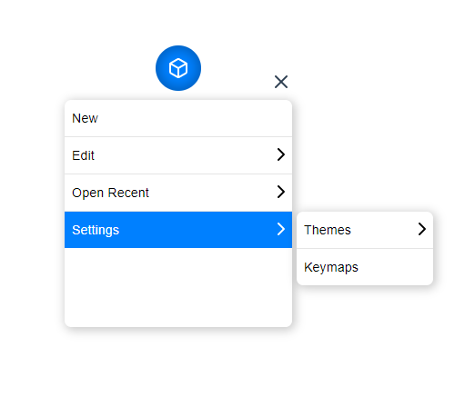

# float-menu

[](https://dev.azure.com/prabhummurthy/float-menu/_build/latest?definitionId=5&branchName=master)
[](https://www.codacy.com/manual/prabhuignoto/float-menu?utm_source=github.com&amp;utm_medium=referral&amp;utm_content=prabhuignoto/float-menu&amp;utm_campaign=Badge_Grade)
[](https://deepscan.io/dashboard#view=project&tid=10074&pid=13372&bid=223016)
[](https://depfu.com/github/prabhuignoto/float-menu?project_id=15010)

Customizable Floating Menu for Vue 3



## About

smart-tagz is a smart input tags components built for Vue 3.

## Features

- **Draggable Menu Handle** - The Menu head can be easily dragged and placed anywhere on the screen.
- **Smart Menu** - The Menu is smart enough to detect the top & bottom edges of the screen and flip the menu depending on the position it is on.
- **Smart Placement** - The Menu head automatically adjusts itself and always stays inside the viewport.
- **Nested Menus** - Support for Nested menus up to any levels. Although it is advisable to keep the nesting to a Minimum to have a good UX.
- **Composition API** - Built using the latest Composition API from Vue 3.
- **Typescript** - Built with Typescript.

## Installation

```sh
yarn run install && yarn run dev
```

## Getting Started

float-menu has some great defaults to get you started quickly. Please check the props list for details on all available options.

```sh
  <MenuHead
    :position="'top left'"
    :dimensions="{width: 50, height: 50}"
    :menu="menu"
    menu-direction="bottom"
  >
    <BoxIcon />
  </MenuHead>
```

## Props

| Prop          | Type     | Description                                                                                                                      | Default                   |
|---------------|----------|----------------------------------------------------------------------------------------------------------------------------------|---------------------------|
| dimension     | Object   | dimension of the Menu Head                                                                                                       | {width: 3, height: 3}     |
| position      | String   | Initial position of the Menu Head. can be any one of the following values "top left", "top right", "bottom left", "bottom right" | "top left"                |
| fixed         | Boolean  | Disables dragging on the Menu Head                                                                                               | false                     |
| menuDirection | String   | prop to set the Menu's orientation. can accept top or bottom.                                                                    | "top"                     |
| menuDimension | Object   | prop to set the width and minimum height of the Menu.                                                                            | {width: 250, height: 250} |
| menuData      | Object   | Array data to generate the nested menu                                                                                           | []                        |
| on-selected   | Function | Hook to call on selection                                                                                                        |                           |

## Built with

- [Vue.JS](vue) - The Component is written in Vue + [Typescript](typescript).

## Notes

- The component is built using the RC version of Vue 3 and heavily relies on the composition API.
- The project uses [vite](vite) instead of @vue/cli. I choose vite for speed and i also believe [vite](vite) will be the future.

## Meta

Prabhu Murthy – [@prabhumurthy2](https://twitter.com/prabhumurthy2) – prabhu.m.murthy@gmail.com

Distributed under the MIT license. See `LICENSE` for more information.

[https://github.com/prabhuingoto/](https://github.com/prabhuingoto/)

<!-- Markdown link & img dfn's -->

[vue]: https://vuejs.org
[typescript]: https://typescriptlang.org
[vite]: https://github.com/vitejs/vite