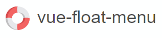
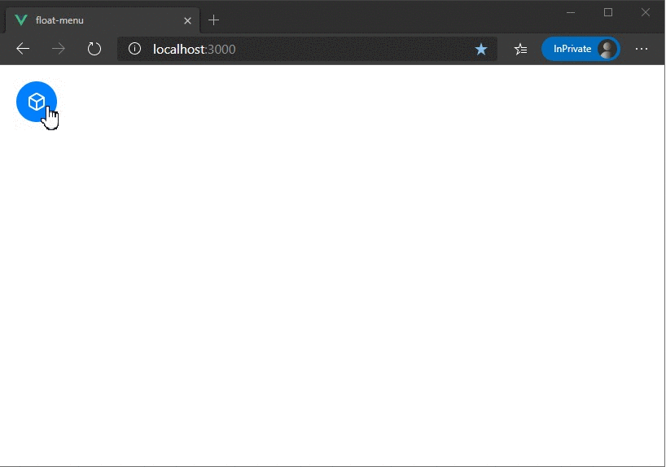
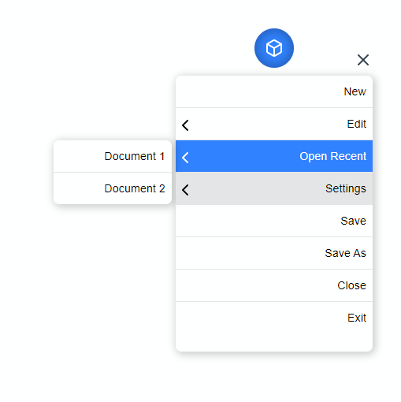
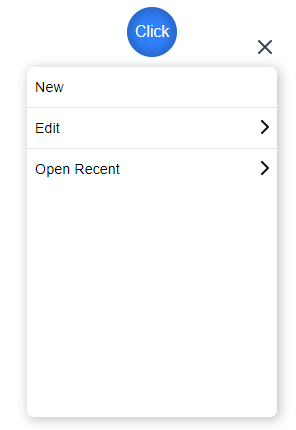

[](https://codeclimate.com/github/prabhuignoto/float-menu/maintainability)
[](https://www.codacy.com/manual/prabhuignoto/float-menu?utm_source=github.com&amp;utm_medium=referral&amp;utm_content=prabhuignoto/float-menu&amp;utm_campaign=Badge_Grade)
[](https://deepscan.io/dashboard#view=project&tid=10074&pid=13372&bid=223016)
[](https://lgtm.com/projects/g/prabhuignoto/float-menu/context:javascript)

[](https://depfu.com/github/prabhuignoto/float-menu?project_id=15010)



>Customizable Floating Menu for Vue 3


⚡ [Edit on Stackblitz](https://stackblitz.com/edit/vue-mkrnwq?file=src/App.vue)

## Features

✅ **Draggable Menu Handle** - Drag and easily place the Menu anywhere on screen.

✅ **Smart Menu** - Detects the top & bottom edges of the screen and flips the menu automatically.

✅ **Smart Placement** - The Menu head automatically adjusts itself and always stays inside the viewport.

✅ **Nested Menus** - Support for Nested menus up to any levels.

✅ **Composition API** - Built using the latest Composition API from Vue 3.

## ⚙ Installation

```sh
yarn install vue-float-menu
```

## 🚀 Getting Started

float-menu has some great defaults. Please check the props list for details on all available options.

The following snippet sets the default position of the menu as `top left` and default menu direction as `bottom`.

```sh
  <float-menu
    position="top left"
    :dimension="50"
    :menu="menuData"
    menu-direction="bottom"
  >
    <BoxIcon />
  </float-menu>
```

## 📺 Demo



## Props

| Prop             | Type     | Description                                                                                                                      |
| ---------------- | -------- | -------------------------------------------------------------------------------------------------------------------------------- |
| dimension        | number   | dimension of the Menu Head `width x height` in pixels.                                                                           |
| position         | String   | Initial position of the Menu Head. can be any one of the values `top left`, `top right`, `bottom left`, `bottom right`           |
| fixed            | Boolean  | Disables dragging and the Menu will be fixed. use the `position` prop to fix the menu position                                   |
| menu-orientation | String   | Set's the Menu's orientation. can be `top` or `bottom`.                                                                          |
| menu-dimension   | Object   | Set's the `width` and `minimum` height of the Menu.                                                                              |
| menu-data        | Object   | Array data to generate the nested menu's.                                                                                        |
| on-selected      | Function | Hook that is called on selection.                                                                                                |
| flip-on-edges    | Boolean  | Flips the Menu content automatically, when there is no space to display nested menus.                                            |

### Dimension

`dimension` prop can be used to set the width and height of the menu head. The prop takes a single number value to set the height and width of the Menu Head.

```sh
  <float-menu :dimension=50>
    <BoxIcon />
  </float-menu>
```

### Position

The `position` prop can be used to set the initial position of the Menu Head. The prop can accept any one of the following values.

- `top left` (default)
- `top right`
- `bottom left`
- `bottom right`

```sh
  <float-menu :dimension=50 position="bottom right">
    <BoxIcon />
  </float-menu>
```

### Fixed position

To disable dragging and to fix the position statically, set `fixed` to `true`. This prop is disabled by default. Use this prop along with the `position` prop to set the desired position.

```sh
  <float-menu :dimension=50 position="bottom right" fixed>
    <BoxIcon />
  </float-menu>
```

### Menu orientation

sets the default orientation of the menu. can be set to either `top` or `bottom`.

```sh
  <float-menu :dimension=50 position="bottom right" menu-orientation="bottom">
    <BoxIcon />
  </float-menu>
```

### Menu head dimension

prop to set the `height` and `width` of the menu.

```sh
  <float-menu
    :dimension=50
    :menu-dimension="{height: 400, width: 300}"
    position="bottom right"
    menu-orientation="bottom"
    <BoxIcon />
  </float-menu>
```

### Populating Menu

Use the `menu-data` prop to create Simple or Nested menus of your liking. `menu-data` takes an array of `MenuItem` type

**List of MenuItem properties**

| property    | description                                                           |
| ----------- | --------------------------------------------------------------------- |
| name        | display name of the menu item.                                        |
| id          | unique id of each menu item. this is auto generated by the component. |
| selected    | flag to highlight a sub-menu selection.                               |
| showSubMenu | flag to show/hide the sub-menu.                                       |
| subMenu     | data for the sub-menu                                                 |

Here we create a simple Menu structure with 3 Menu items with no sub menus.

```sh
const menuData = [
  { name: "New" },
  {
    name: "Edit",
    subMenu: {
      name: "edit-items",
      items: [{ name: "Copy" }, { name: "Paste" }],
    },
  },
  {
    name: "Open Recent",
    subMenu: {
      name: "recent-items",
      items: [{ name: "Document 1" }, { name: "Document 2" }],
    },
  },
]
```

```sh
  <float-menu
    :dimension=50
    :menu-dimension="{height: 400, width: 300}"
    :menu-data="menuData"
    position="bottom right"
    menu-orientation="bottom">
    <BoxIcon />
  </float-menu>
```


### on-select

hook for the menu item selection event.

```sh
  <float-menu
    :dimension=50
    position="bottom right"
    :menu-dimension="{height: 400, width: 300}"
    :menu-data="{items: [{name: 'File'}, {name: 'Open'}]}"
    on-select="handleSelection"
    menu-orientation="bottom">
    <BoxIcon />
  </float-menu>
```

### Auto flip on edges

setting this prop `flips` the menu content on the right edges of the screen. This is useful you have nested menus of many levels.

```sh
  <float-menu
    :dimension=50
    position="bottom right"
    flip-on-edges
    on-select="handleSelection"
    menu-orientation="bottom">
    <BoxIcon />
  </float-menu>
```



### Custom icon

To customize the Menu Icon, simply pass any content in between the `float-menu` tags. Here we render a custom icon.

```sh
  <float-menu
    :dimension=50
    :menu-data="menuData"
    menu-orientation="bottom">
    <BoxIcon />
  </float-menu>
```

and here we render a custom text inside the Menu handle

```sh
  <float-menu
    :dimension=50
    :menu-data="menuData"
    menu-orientation="bottom">
    Click Me
  </float-menu>
```



## 🔨 Built with

- [Vue.JS](vue) - The Component is written in Vue + [Typescript](typescript).

## 📄 Notes

- The project uses [vite](vite) instead of @vue/cli. I choose vite for speed and i also believe [vite](vite) will be the future.

## Meta

Prabhu Murthy – [@prabhumurthy2](https://twitter.com/prabhumurthy2) – prabhu.m.murthy@gmail.com

[https://www.prabhumurthy.com](https://www.prabhumurthy.com)

Distributed under the MIT license. See `LICENSE` for more information.

[https://github.com/prabhuingoto/](https://github.com/prabhuingoto/)

<!-- Markdown link & img dfn's -->

[vue]: https://vuejs.org
[typescript]: https://typescriptlang.org
[vite]: https://github.com/vitejs/vite
